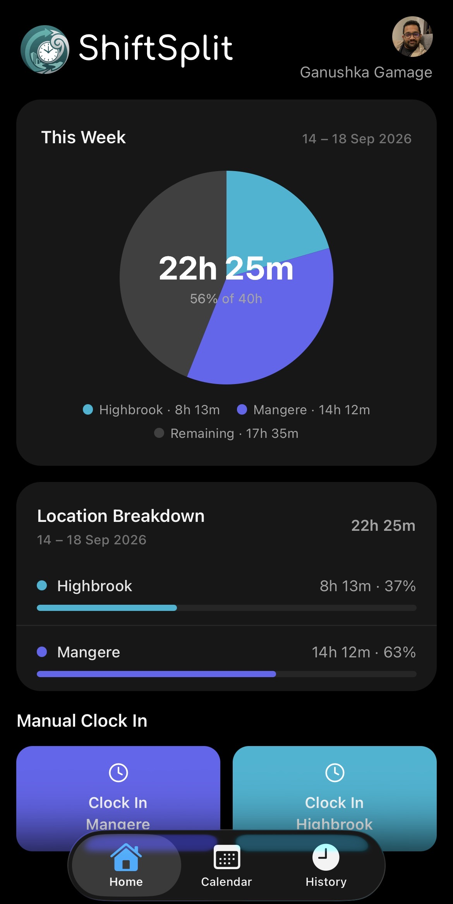
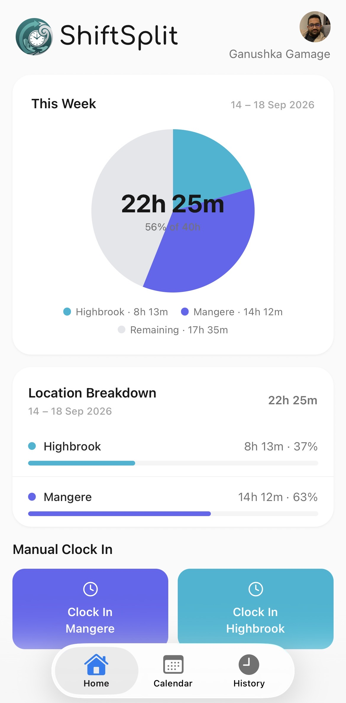
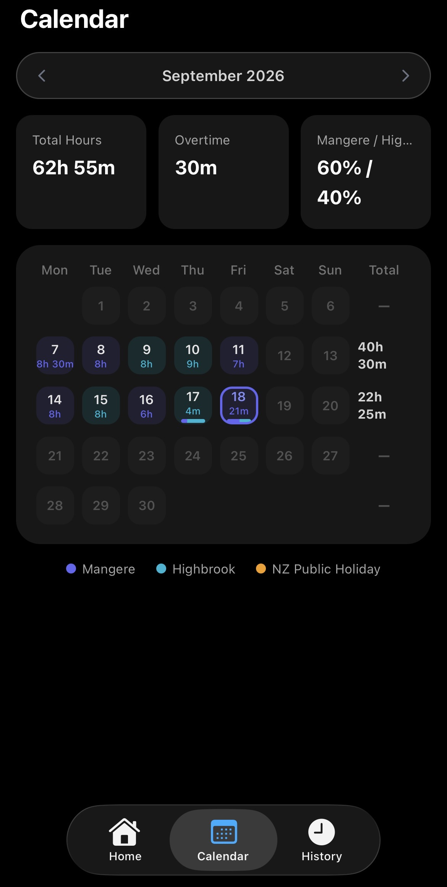

# ShiftSplit

A geofenced time-tracking app for staff working across two NZ office locations — **Mangere** and **Highbrook** — built with Expo/React Native and Supabase.

| Dashboard (dark) | Dashboard (light) | Calendar |
| --- | --- | --- |
|  |  |  |

## Features

- **Automatic geofenced sign-in/out** — background location monitoring detects arrival/departure at each office and prompts you to sign in or out via a notification, no manual action required.
- **Manual sign-in** — for the days geofencing isn't practical, with a **Weekend Sign-In** toggle (off by default) so hours can't accidentally be logged on Saturdays/Sundays.
- **Weekly dashboard** — a progress ring against your 40h/week target (swipe or use the arrows to browse previous weeks), a color-coded legend per office, overtime tracking, and the current signed-in session with its start time.
- **History** — a week-by-week breakdown of hours worked per office.
- **Calendar** — a full month grid showing hours per day, totals per week, NZ public holidays (national + Auckland regional), and free navigation to past/future months (swipe or use the arrows) with a one-tap "Today" button.
- **Profile & preferences** — display name and avatar (stored in Supabase Storage), light/dark/system theme, an app-wide font size setting (Small/Medium/Large/XL), and notification controls.
- **Realtime sync** — sign in/out from a notification action or another device and every screen updates immediately via Supabase Realtime.

## Tech stack

- [Expo](https://expo.dev) (SDK 57) with Expo Router and native tabs
- React Native 0.86 + NativeWind (Tailwind for React Native)
- [Supabase](https://supabase.com) — Auth, Postgres, Row Level Security, Realtime, Storage
- `expo-location` background geofencing + `expo-notifications`

## Get started

1. Install dependencies

   ```bash
   npm install
   ```

2. Copy `.env.example` to `.env` and fill in your Supabase project URL/anon key (and an NZ public holidays API key if you want holiday data in the Calendar tab).

3. Run `schema.sql` once in your Supabase project's SQL Editor — it sets up all tables, RLS policies, RPCs, Realtime publication, and the avatars storage bucket.

4. Build and launch the native app (required at least once, and again any time a native dependency changes):

   ```bash
   npm run ios       # or: npm run android
   ```

   For JS-only changes after that, `npm start` (Metro only) is enough if a dev client is already installed.

## Other commands

```bash
npm run lint                          # ESLint
npx tsc --noEmit -p tsconfig.json     # Typecheck (no test suite — this is the main correctness gate)
```

## Learn more

Built on Expo — see the [Expo documentation](https://docs.expo.dev/) for framework fundamentals and guides.

---

By Ganushka Gamage ❤️
